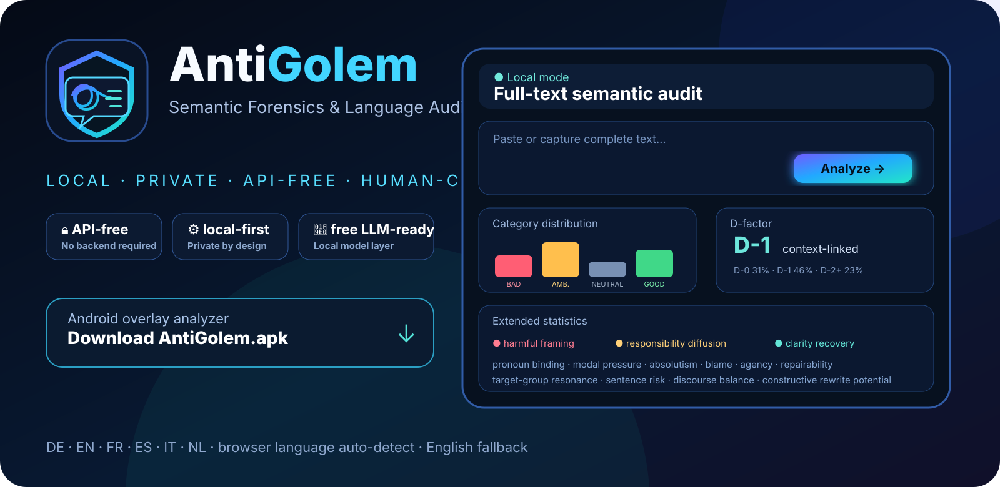
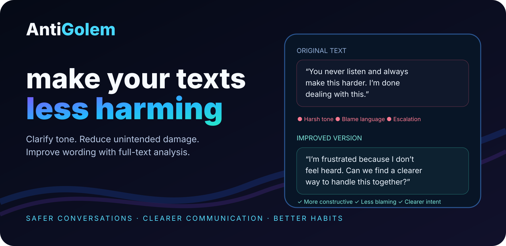
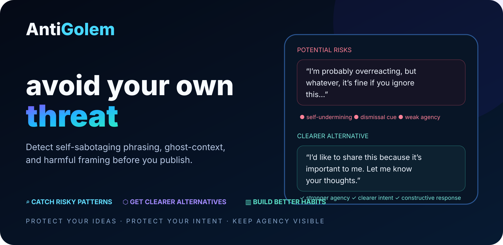
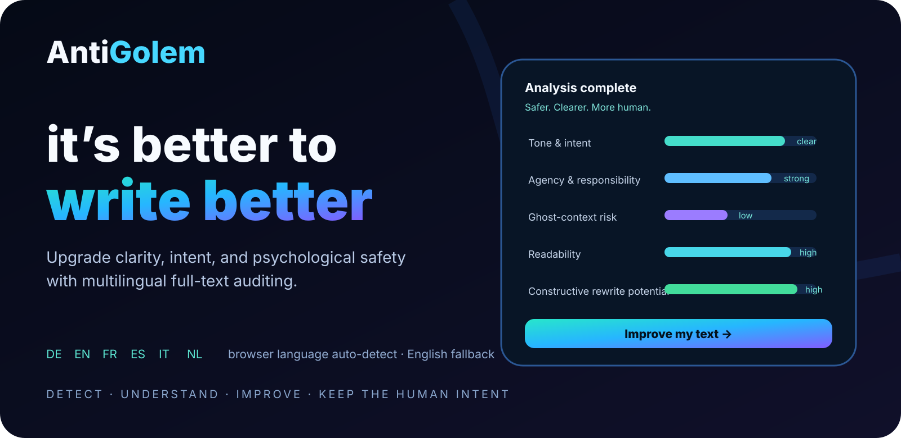

<p align="center">
  
</p>

<h1 align="center">AntiGolem</h1>
<p align="center"><b>Semantic Forensics & Language Audit</b><br/>Clearer texts. Stronger agency. Local-first analysis.</p>

<p align="center">
  <a href="https://chekento.github.io/antigolem/"></a>
  <a href="https://github.com/chekento/antigolem/releases/latest/download/AntiGolem.apk"></a>
</p>

<p align="center">
  <a href="https://chekento.github.io/antigolem/about.html">About</a> ·
  <a href="https://chekento.github.io/antigolem/methodology.html">Methodology</a> ·
  <a href="https://chekento.github.io/antigolem/local-ai.html">Local AI</a> ·
  <a href="https://chekento.github.io/antigolem/privacy.html">Privacy</a>
</p>

<p align="center">
  
</p>

## Analyze the whole text — not a few examples

AntiGolem performs a **sentence-by-sentence full-text audit**. The deterministic engine always works without an API key, account, or inference server. It combines structural language analysis with an optional local LLM cross-check.

| Core audit | Extended statistics | Local AI |
|---|---|---|
| BAD / AMBIVALENT / GOOD / NEUTRAL | word count & sentence length | Browser `LanguageModel` / Prompt API when available |
| D-0 / D-1 / D-2+ binding | lexical diversity | optional Qwen2.5-0.5B via WebLLM/WebGPU |
| ghost-context heuristics | absolutism & modal pressure | model runs locally after model/runtime download |
| Golem/Pygmalion framing tags | blame cues & question/exclamation rate | no paid inference API |
| responsibility diffusion / over-inclusive “we” | critical/high risk count | deterministic engine remains the fallback |
| target-group resonance + rewrites | constructive share + heuristic clarity index | local AI is a second opinion, not a diagnosis |

> **Method note:** terms such as “Golem effect”, “Pygmalion effect”, “mantra”, “ghost-context”, and “psychological programming” are used as **editorial/rhetorical heuristics**. AntiGolem does not claim that wording literally programs a brain or proves subconscious causation.

---

## 1.4 — Strict analysis, direct rewrite & friendly reply

AntiGolem now defaults to a **strict wording audit**. Negative-normalization signals are not cancelled merely because the same sentence also contains a positive keyword. D-2+ remains critical, D-1 is treated more cautiously, and responsibility diffusion, over-inclusive “we”, absolutism and modal pressure can raise the rating even when no explicit failure word is present.

After every analysis the user gets three direct workflow actions:

- **Apply improvements** — rewrites the current source text and immediately re-runs the audit.
- **Undo** — restores the previous source version.
- **Create friendly critique** — creates an editable, respectful reply asking the author to improve wording without accusing them of motives or presenting psychological harm as a proven fact.

For **Apply improvements**, AntiGolem first uses the already available local on-device model path when compatible. The rewrite prompt is constrained to preserve facts, names, numbers, links, chronology, viewpoint and intended meaning, while improving explicit references, reducing unnecessary absolutism and avoiding failure/powerlessness as a default frame. If no local LLM is available, a deterministic conservative rewrite layer applies safe lexical corrections instead.

The friendly critique generator summarizes the actual findings — for example negative default framing, ambiguous references, broad responsibility or absolute wording — and turns them into a polite improvement request. The result is editable, copyable and can optionally be refined by the local model.

Automatic rewrites should still be reviewed before publication, particularly for technical, legal or highly context-sensitive text.

---

## Android — Floating Toolkit + Circle Select

<a href="https://github.com/chekento/antigolem/releases/latest/download/AntiGolem.apk">
  
</a>

After the user explicitly enables the **AntiGolem Screen Text Analyzer** accessibility service, a compact floating AntiGolem icon remains available over the Android launcher and normal apps. Tap it to open the interactive Air-Command/XRecorder-style toolkit.

**Toolkit actions:**

- **Circle Select & analyze** — temporarily opens a transparent full-screen selection layer. Draw an oval around the content you want checked; AntiGolem collects only accessibility-visible text whose screen bounds intersect that oval and analyzes that selection.
- **Analyze visible text** — analyzes the accessibility-visible text from the whole active app window.
- **Open text file** — opens Android's system document picker and imports text locally.
- **Write / paste text** — opens the main editor and focuses the text input.
- **Open AntiGolem** — opens the complete analyzer.
- **Local AI** — opens the local-model information/control page.
- **Toolkit settings** — opens Android Accessibility settings.

The floating icon is compact, draggable and can close the menu either by tapping it again or by using the explicit close control. Capture occurs only after an explicit toolkit action; there is no background text harvesting.

**Circle Select is API-free and does not take a screenshot.** It uses Android accessibility node bounds to decide which text belongs to the marked region. This means ordinary app/UI text works well, while image-only text, canvas-rendered text, video, protected surfaces and some PDF viewers may still require a future local OCR/screen-capture path.

Text files can also be selected from the web-style **Open file** control inside the APK. Android WebView implements the native file chooser path instead of silently cancelling file requests.

The APK uses the same **shield + speech bubble + tangled-to-clear text** AntiGolem icon as the repository branding.

---

## Six languages automatically

**Deutsch · English · Français · Español · Italiano · Nederlands**

The GitHub Pages app detects the visitor’s browser languages on first use. If one of the six supported languages is found, it becomes the default. Otherwise AntiGolem starts in **English**. A manually selected language is remembered locally.

---

<p align="center"></p>

<p align="center"></p>

<p align="center"></p>

---

## Privacy architecture

The rule-based audit is local-first and does not require an AntiGolem backend. When a browser-provided local language model is available, AntiGolem can use it directly. On compatible WebGPU devices, users may optionally load a small open local model; this requires downloading runtime/model files, but the analyzed text is not sent to a paid inference API by AntiGolem.

[About](https://chekento.github.io/antigolem/about.html) · [Methodology](https://chekento.github.io/antigolem/methodology.html) · [Local AI](https://chekento.github.io/antigolem/local-ai.html) · [Privacy](https://chekento.github.io/antigolem/privacy.html) · [Live app](https://chekento.github.io/antigolem/) · [Latest APK](https://github.com/chekento/antigolem/releases/latest/download/AntiGolem.apk)

<details>
<summary><strong>Repository / developer / build details</strong></summary>

### Project structure

- `index.html`, `styles.css`, `app.js` — core GitHub Pages app
- `about.html`, `methodology.html`, `local-ai.html`, `privacy.html` — canonical static subpages
- `about/`, `methodology/`, `local-ai/`, `privacy/` — clean URL redirect aliases
- `404.html` — route recovery / friendly fallback
- `locale-bootstrap.js` — browser-language detection and English fallback
- `advanced-stats.js` — extended local heuristic metrics
- `local-ai.js` — API-free local LLM cross-check + shared local generation layer
- `editor-tools.js` — strict rating override, apply/undo rewriting and friendly reply workflow
- `report-i18n.js` — localized audit protocol text
- `assets/brand/` — AntiGolem visual identity
- `assets/marketing/` — repository/app marketing artwork
- `android/` — Android wrapper + floating Accessibility toolkit
- `.github/workflows/android.yml` — automated APK build and latest release

### Android package

`cloud.kosch.antigolem`

### Build locally

```bash
gradle -p android :app:assembleDebug
```

### CI / release behavior

Every relevant Android change triggers the GitHub Actions APK workflow. The current public APK is debug-signed for testing. A production/Play Store build should use a private persistent signing key and an AAB release workflow.

### GitHub Pages

The site is static and lives in the repository root. Configure GitHub Pages once with:

`Settings → Pages → Deploy from a branch → main → /(root)`

Canonical subpage URLs use direct `.html` files to avoid route ambiguity on GitHub Pages. Clean directory URLs remain as redirect aliases.

### Local LLM strategy

1. Prefer the browser-provided `LanguageModel` Prompt API when available.
2. Otherwise, on WebGPU-capable clients, AntiGolem can optionally initialize `Qwen2.5-0.5B-Instruct-q4f16_1-MLC` through WebLLM.
3. If neither local model path is available, the deterministic full-text audit, strict rating, extended statistics, rewrite fallback and reply generator continue to work normally.

</details>

---

<p align="center"><b>AntiGolem</b> · local · private · open · human-centric</p>
